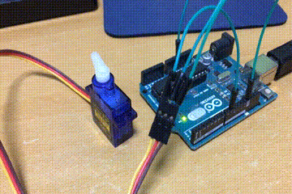

# Part4 Arduino

## 4.0 Installation

Terminal 1

```bash
$ bash ~/ros1_ws/src/rospy_tutorial/part4_arduino/install.bash
$ cd ~/ros1_ws
$ catkin_make
$ roscore
```

Terminal 2 (After Arduino installation)

```bash
$ rosrun rosserial_arduino make_libraries.py ~/Arduino/libraries
```

## 4.1 Blink LED

- Write "blink.ino" to Arduino UNO.

```bash
$ roslaunch part4_1_led_pub blink.launch
```

## 4.2 Button

- Write "button.ino"  to Arduino UNO.

```bash
$ roslaunch part4_2_button_sub button.launch
```

## 4.3 Servo

- Write "servo.ino" to Arduino UNO.

```bash
$ roslaunch part4_3_servo_pub servo.launch
```



